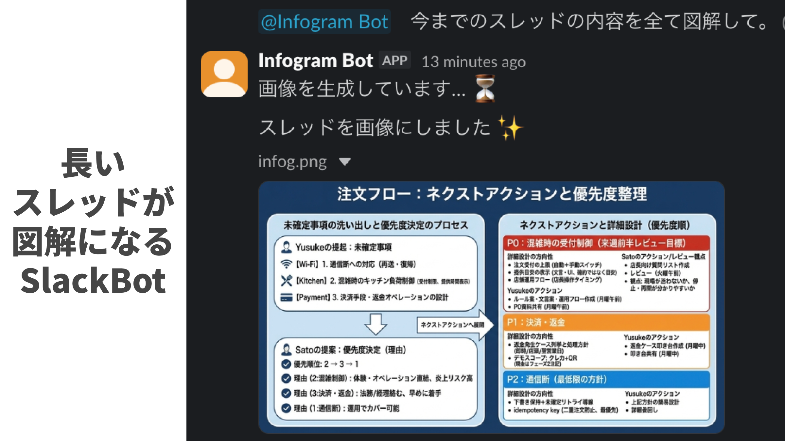

# slack-banana

Slackのスレッド内容をAIでインフォグラフィック画像に変換するBotです。

スレッド内でBotをメンションするだけで、会話の内容を1枚のわかりやすい画像にまとめてくれます。

## 必要なもの

- Googleアカウント
- Slackワークスペースの管理者権限（またはアプリを追加できる権限）
- Gemini APIキー（無料で取得可能）

## セットアップ手順

### Step 1: Slackアプリの作成

#### 1-1. アプリを作成する

1. [Slack API](https://api.slack.com/apps) にアクセス
2. 右上の「Create New App」をクリック
3. 「From scratch」を選択
4. App Name に好きな名前を入力（例：`banana-bot`）
5. ワークスペースを選択して「Create App」をクリック

#### 1-2. Bot Token Scopes を設定する

1. 左メニューから「OAuth & Permissions」を選択
2. 「Scopes」セクションまでスクロール
3. 「Bot Token Scopes」の「Add an OAuth Scope」をクリック
4. 以下の4つのスコープを追加：
   - `app_mentions:read` - メンションを受け取るため
   - `chat:write` - メッセージを送信するため
   - `channels:history` - パブリックチャンネルのスレッドを読むため
   - `files:write` - 画像をアップロードするため

#### 1-3. アプリをワークスペースにインストールする

1. 左メニューから「OAuth & Permissions」を選択
2. ページ上部の「Install to Workspace」をクリック
3. 権限を確認して「許可する」をクリック
4. 表示される「Bot User OAuth Token」（`xoxb-`で始まる）をコピーして保存

#### 1-4. Verification Token を取得する

1. 左メニューから「Basic Information」を選択
2. 「App Credentials」セクションの「Verification Token」をコピーして保存

---

### Step 2: Gemini APIキーの取得

1. [Google AI Studio](https://aistudio.google.com/) にアクセス
2. Googleアカウントでログイン
3. 左メニューから「Get API key」をクリック
4. 「Create API key」をクリック
5. プロジェクトを選択（または新規作成）
6. 生成されたAPIキーをコピーして保存

---

### Step 3: Google Apps Script の設定

#### 3-1. 新規プロジェクトを作成する

1. [Google Apps Script](https://script.google.com/) にアクセス
2. 「新しいプロジェクト」をクリック
3. 左上の「無題のプロジェクト」をクリックして、名前を変更（例：`slack-banana`）

#### 3-2. コードを貼り付ける

1. 最初から入っている `function myFunction() {}` を全て削除
2. このリポジトリの `Code.gs` の内容を全てコピーして貼り付け
3. `Ctrl + S`（Mac: `Cmd + S`）で保存

#### 3-3. スクリプトプロパティを設定する

1. 左メニューの歯車アイコン「プロジェクトの設定」をクリック
2. 「スクリプト プロパティ」セクションまでスクロール
3. 「スクリプト プロパティを追加」をクリックして、以下の3つを追加：

| プロパティ | 値 |
|-----------|-----|
| `SLACK_BOT_TOKEN` | Step 1-3 で取得した `xoxb-...` から始まるトークン |
| `SLACK_VERIFICATION_TOKEN` | Step 1-4 で取得した Verification Token |
| `GEMINI_API_KEY` | Step 2 で取得した Gemini API キー |

4. 「スクリプト プロパティを保存」をクリック

---

### Step 4: デプロイとSlack連携

#### 4-1. ウェブアプリとしてデプロイする

1. 右上の「デプロイ」ボタンをクリック
2. 「新しいデプロイ」を選択
3. 「種類の選択」の歯車アイコンをクリックし、「ウェブアプリ」を選択
4. 以下のように設定：
   - 説明: 任意（例：`初回デプロイ`）
   - 次のユーザーとして実行: 「自分」
   - アクセスできるユーザー: 「全員」
5. 「デプロイ」をクリック
6. 「アクセスを承認」をクリックし、Googleアカウントで認証
7. 表示される「ウェブアプリ」のURLをコピー

#### 4-2. Slack の Event Subscriptions を設定する

1. [Slack API](https://api.slack.com/apps) に戻り、作成したアプリを選択
2. 左メニューから「Event Subscriptions」を選択
3. 「Enable Events」を「On」に切り替え
4. 「Request URL」に、Step 4-1 でコピーしたURLを貼り付け
5. 緑色のチェックマーク「Verified」が表示されるのを確認
6. 「Subscribe to bot events」の「Add Bot User Event」をクリック
7. `app_mention` を追加
8. ページ下部の「Save Changes」をクリック

#### 4-3. Botをチャンネルに招待する

1. Slackで、Botを使いたいチャンネルを開く
2. チャンネル名をクリックして設定を開く
3. 「インテグレーション」タブを選択
4. 「アプリを追加する」をクリック
5. 作成したアプリ（例：`banana-bot`）を追加

---

## 使い方

1. Slackでスレッド（会話）を開く
2. スレッド内で `@banana-bot`（作成したBot名）をメンション
3. 数秒待つと、スレッドの内容をまとめたインフォグラフィック画像が投稿される

---

## 注意事項

- **プライベートチャンネル**: プライベートチャンネルで使う場合は、追加のスコープ `groups:history` が必要です。Step 1-2 で追加してください。
- **API制限**: Gemini APIには無料枠があります。大量に使用する場合は [料金ページ](https://ai.google.dev/pricing) を確認してください。
- **画像生成の時間**: 画像生成には数秒〜十数秒かかることがあります。
- **Slackのリトライ**: 画像生成中にSlackがリクエストをリトライすることがありますが、重複処理は防止されているため正常に動作します。

---

## トラブルシューティング

### 「Verified」にならない

- URLが正しくコピーされているか確認
- Google Apps Script のデプロイで「アクセスできるユーザー」が「全員」になっているか確認

### Botが反応しない

- Botがチャンネルに招待されているか確認
- Event Subscriptions で `app_mention` が追加されているか確認
- スクリプトプロパティが正しく設定されているか確認

### エラーメッセージが表示される

- Gemini API キーが正しいか確認
- Slack Bot Token が正しいか確認
- Google Apps Script の「実行数」で詳細なエラーログを確認

---

## ライセンス

MIT License
